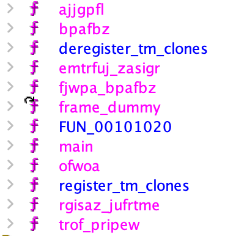

# alienmath
## Rev (494 points, first blood!) by nope

> There's a transmission coming in but we can't figure out they're trying to say. They were nice enough to send us the binary they're using on their transmission, but it still doesn't make any sense. Can you help?

## Attachments
- `nc alien.chal.irisc.tf 10600`
- alien_math (x86 ELF executable)

## Solution

A classic x86 reversing challenge with a Unicode twist! After running through the basics (`file alien_math`), we put `alien_math` into Ghidra and take a look at the output. For me, the first thing I take a look at is the functions, to see if there are any descriptive names that could help with reversing.



Without any useful function names, it's not even worth figuring out `main` yet. Let's go through and see if we can identify what at least some of the functions do:

```c
int bpafbz(int param_1,int param_2)

{
  int iVar1;
  
  iVar1 = rand();
  return param_1 + iVar1 % (param_2 - param_1);
}
```

Easy, random integer in the range `[param_1, param2)`. We can rename this to `randBetween`.

```c
void fjwpa_bpafbz(void)

{
  time_t tVar1;
  int local_c;
  
  tVar1 = time((time_t *)0x0);
  srand((uint)tVar1);
  for (local_c = 0; local_c < 0x3f; local_c = local_c + 1) {
    rand();
  }
  return;
}
```

Seems to initialize the random number generator, generate a bunch of random numbers, and throw those numbers away. We'll rename this to `randinit`.

```c
void ofwoa(char *param_1,char *param_2)

{
  size_t __n;
  
  __n = strlen(param_1);
  strncmp(param_1,param_2,__n);
  return;
}
```

Seems to just be `strcmp`.

```c
void trof_pripew(byte *param_1)

{
  size_t sVar1;
  byte *local_20;
  byte *local_10;
  
  if (param_1 != (byte *)0x0) {
    sVar1 = strlen((char *)param_1);
    local_10 = param_1 + (sVar1 - 1);
    for (local_20 = param_1; local_20 < local_10; local_20 = local_20 + 1) {
      *local_20 = *local_20 ^ *local_10;
      *local_10 = *local_10 ^ *local_20;
      *local_20 = *local_20 ^ *local_10;
      local_10 = local_10 + -1;
    }
  }
  return;
}
```

This is a little tricky to understand at a quick glance. The contents of the loop are a swap algorithm, without using a temporary variable. By taking a look at how `local_10` and `local_20` behave, we can recognize this as as a reversing algorithm! Let's rename this to `reverse_string`.

Now, we can take a look at the more complex functions.

```c
void * rgisaz_jufrtme(uint param_1)

{
  char *__s;
  char *__s_00;
  void *pvVar1;
  size_t sVar2;
  size_t sVar3;
  double dVar4;
  double dVar5;
  int local_38;
  int local_34;
  
  dVar4 = log10((double)(param_1 + 1));
  dVar4 = ceil(dVar4);
  dVar5 = log10((double)(param_1 + 1));
  dVar5 = ceil(dVar5);
  __s_00 = (char *)malloc((long)((int)(dVar4 + 1.0) + 1));
  pvVar1 = malloc((long)((int)((dVar5 + 1.0) * 8.0 * 3.0) + 1));
  sprintf(__s_00,"%o",(ulong)param_1);
  strrev(__s_00);
  sVar2 = strlen(__s_00);
  local_38 = 0;
  for (local_34 = 0; local_34 < (int)sVar2; local_34 = local_34 + 1) {
    __s = *(char **)(lfwp + (long)(__s_00[local_34] + -0x30) * 8);
    sVar3 = strlen(__s);
    memcpy((void *)((long)local_38 + (long)pvVar1),__s,(long)(int)sVar3);
    local_38 = local_38 + (int)sVar3;
  }
  *(undefined *)((long)pvVar1 + (long)local_38) = 0;
  free(__s_00);
  return pvVar1;
}
```

There's a lot of weird math happening here related to buffer sizes, but the main parts are (with a bit of variable renaming):

```c
  sprintf(octal,"%o",(ulong)param_1);
  strrev(octal);
  sVar1 = strlen(octal);
  j = 0;
  for (i = 0; i < (int)sVar1; i = i + 1) {
    __s = *(char **)(lfwp + (long)(octal[i] + -0x30) * 8);
    sVar2 = strlen(__s);
    memcpy((void *)((long)j + (long)alienized),__s,(long)(int)sVar2);
    j = j + (int)sVar2;
  }
  *(undefined *)((long)alienized + (long)j) = 0;
  free(octal);
  return alienized;
```

This seems to be how numbers get translated into whatever the alien language is, by converting it to octal, then mapping each octal digit into some string. Let's take a look at the output of the program, just to see what we need to translate:

```
╜═─┬┼ │┘┘│╒┼ ┬┼─┤┴╣┼─ ┼┐┘┐└╙┴╓│ ┬├╪┘╚├。
╨│┼╫┘┐┴┘╪ ┼╞╧╣ ╖╪└┼┴┬╝─ ┐├┬╫╢╡╨ ┤╞│║┐╘┴├
│┤╧│╬─ ╕╤┴┘└┘┤┌╒┘ ┌┴╖┼═╪ ┘╒┴│├│？

・├┴╗╬。 ┴┘╟│ ・┤┤╙・┬╒┘─└┴・┴┐┤┬ ╞└╠╤├┼│ ・╝└┤┐┼・╝└┤┐┼・├╡┌└┬╥？
```

Unicode box drawing characters!

Ok, how do we figure out what each octal digit maps to? This is where `lfwp` comes in: it represents an array of pointers to C strings (`char***`!). If we look at `lfwp`, it looks something like this:

```
                             lfwp                                            XREF[7]:     Entry Point(*), 
                                                                                          rgisaz_jufrtme:00101511(*), 
                                                                                          rgisaz_jufrtme:00101518(R), 
                                                                                          emtrfuj_zasigr:00101617(*), 
                                                                                          emtrfuj_zasigr:0010161e(R), 
                                                                                          emtrfuj_zasigr:0010163e(*), 
                                                                                          emtrfuj_zasigr:00101645(R)  
           00104020 08              undefined108h                     [0]           ?  ->  00102008     XREF[7]:     Entry Point(*), 
                                                                                                                     rgisaz_jufrtme:00101511(*), 
                                                                                                                     rgisaz_jufrtme:00101518(R), 
                                                                                                                     emtrfuj_zasigr:00101617(*), 
                                                                                                                     emtrfuj_zasigr:0010161e(R), 
                                                                                                                     emtrfuj_zasigr:0010163e(*), 
                                                                                                                     emtrfuj_zasigr:00101645(R)  
           00104021 20              undefined120h                     [1]
           00104022 10              undefined110h                     [2]
           00104023 00              undefined100h                     [3]
           00104024 00              undefined100h                     [4]
           00104025 00              undefined100h                     [5]
           00104026 00              undefined100h                     [6]
           00104027 00              undefined100h                     [7]
           00104028 15              undefined115h                     [8]           ?  ->  00102015
           00104029 20              undefined120h                     [9]
           0010402a 10              undefined110h                     [10]
           0010402b 00              undefined100h                     [11]
           0010402c 00              undefined100h                     [12]
           0010402d 00              undefined100h                     [13]
           0010402e 00              undefined100h                     [14]
           0010402f 00              undefined100h                     [15]
```

Each of these represents a pointer value (`0x0000000000102008`, `0x0000000000102015`, etc.) that points to a C string. Let's take a look at the first one (`0x102008`):

```
        00102008 e3              ??         E3h
        00102009 83              ??         83h
        0010200a bb              ??         BBh
        0010200b e2              ??         E2h
        0010200c 94              ??         94h
        0010200d a4              ??         A4h
        0010200e e2              ??         E2h
        0010200f 94              ??         94h
        00102010 a4              ??         A4h
        00102011 e2              ??         E2h
        00102012 95              ??         95h
        00102013 99              ??         99h
        00102014 00              ??         00h

        00102015 e3              ??         E3h
        00102016 83              ??         83h
        00102017 bb              ??         BBh
        00102018 e2              ??         E2h
        00102019 94              ??         94h
        0010201a 9c              ??         9Ch
        0010201b e2              ??         E2h
        0010201c 94              ??         94h
        0010201d b4              ??         B4h
        0010201e e2              ??         E2h
        0010201f 95              ??         95h
        00102020 97              ??         97h
        00102021 e2              ??         E2h
        00102022 95              ??         95h
        00102023 ac              ??         ACh
        00102024 00              ??         00h
```

All the strings are stored back to back. Additionally, these strings are stored as Unicode code points, so we'll have to run those to UTF8. After going through all the strings, we get the following digits:

```python
digits = [
    '・┤┤╙',
    '・├┴╗╬',
    '・╝└┤┐┼',
    '・┬╒┘─└┴',
    '・├╡┌└┬╥',
    '・┴┐┤┬',
    '・└─┐┤─┴┴',
    '・┬╧─┘╣┐',
    '・─'
]
```

Wait, why are there 9? After a lot of confusion, 15 minutes of double checking my code reversing, I realized I hadn't even taken the reverse function into account. We'll get there :)

Let's rename the previous function to `alienize`.

Next, we have the following function:

```c
undefined4 emtrfuj_zasigr(char *param_1)

{
  int iVar1;
  undefined4 uVar2;
  size_t sVar3;
  long in_FS_OFFSET;
  undefined4 local_2c;
  int local_28;
  int local_24;
  int local_20;
  int local_1c;
  void *local_18;
  long local_10;
  
  local_10 = *(long *)(in_FS_OFFSET + 0x28);
  sVar3 = strlen(param_1);
  local_1c = (int)sVar3;
  local_18 = malloc((long)(((local_1c / 6 + (local_1c >> 0x1f) >> 1) - (local_1c >> 0x1f)) + 1));
  local_28 = 0;
  local_24 = 0;
  do {
    if (local_1c <= local_28) {
      *(undefined *)((long)local_18 + (long)local_24) = 0;
      strrev(local_18);
      local_2c = 0;
      __isoc99_sscanf(local_18,&DAT_001020bd,&local_2c);
      uVar2 = local_2c;
LAB_001016e3:
      if (local_10 != *(long *)(in_FS_OFFSET + 0x28)) {
                    /* WARNING: Subroutine does not return */
        __stack_chk_fail();
      }
      return uVar2;
    }
    local_20 = 0;
    while( true ) {
      if (8 < local_20) {
        uVar2 = 1;
        goto LAB_001016e3;
      }
      iVar1 = strcmpAtHome(*(undefined8 *)(lfwp + (long)local_20 * 8),param_1 + local_28);
      if (iVar1 == 0) break;
      local_20 = local_20 + 1;
    }
    sVar3 = strlen(*(char **)(lfwp + (long)local_20 * 8));
    local_28 = local_28 + (int)sVar3;
    *(undefined1 *)((long)local_24 + (long)local_18) = pwfl[local_20];
    local_24 = local_24 + 1;
  } while( true );
}
```

Let's rename some parameters real quick to make the code a little easier to read:

```c
int unalienize(char *str)

{
  int strcmp_result;
  int value;
  size_t digitLen;
  long in_FS_OFFSET;
  int scanned_octal;
  int i;
  int bufLen;
  int j;
  int lenOfStr;
  char *buf;
  long canary;
  
  canary = *(long *)(in_FS_OFFSET + 0x28);
  digitLen = strlen(str);
  lenOfStr = (int)digitLen;
  buf = (char *)malloc((long)(((lenOfStr / 6 + (lenOfStr >> 0x1f) >> 1) - (lenOfStr >> 0x1f)) + 1));
  i = 0;
  bufLen = 0;
  do {
    if (lenOfStr <= i) {
      buf[bufLen] = '\0';
      strrev(buf);
      scanned_octal = 0;
      __isoc99_sscanf(buf,&"%o",&scanned_octal);
      value = scanned_octal;
return_value:
      if (canary != *(long *)(in_FS_OFFSET + 0x28)) {
                    /* WARNING: Subroutine does not return */
        __stack_chk_fail();
      }
      return value;
    }
    j = 0;
    while( true ) {
      if (8 < j) {
        value = 1;
        goto return_value;
      }
      strcmp_result = strcmpAtHome(*(undefined8 *)(lfwp + (long)j * 8),str + i);
      if (strcmp_result == 0) break;
      j = j + 1;
    }
    digitLen = strlen(*(char **)(lfwp + (long)j * 8));
    i = i + (int)digitLen;
    buf[bufLen] = pwfl[j];
    bufLen = bufLen + 1;
  } while( true );
}
```

From here, we can see that it performs roughly the inverse of `alienize`. Additionally, we can finally explain the additional string! By looking at the contents of `pwfl` in Ghidra:

```
                             pwfl                                            XREF[3]:     Entry Point(*), 
                                                                                          unalienize:0010166d(*), 
                                                                                          unalienize:00101674(R)  
        00104010 30 31 32        undefine
                 33 34 35 
                 36 37 2d
           00104010 30              undefined130h                     [0]                               XREF[3]:     Entry Point(*), 
                                                                                                                     unalienize:0010166d(*), 
                                                                                                                     unalienize:00101674(R)  
           00104011 31              undefined131h                     [1]
           00104012 32              undefined132h                     [2]
           00104013 33              undefined133h                     [3]
           00104014 34              undefined134h                     [4]
           00104015 35              undefined135h                     [5]
           00104016 36              undefined136h                     [6]
           00104017 37              undefined137h                     [7]
           00104018 2d              undefined12Dh                     [8]
```

we see that it contains the digits `0` through `7` as well as `-`! Our last "digit" is the negative sign!

Our last function is below:

```c
undefined8 ajjgpfl(int param_1)

{
  undefined4 uVar1;
  uint uVar2;
  uint uVar3;
  uint uVar4;
  int iVar5;
  void *pvVar6;
  void *__ptr;
  undefined8 uVar7;
  long in_FS_OFFSET;
  undefined local_118 [264];
  long local_10;
  
  local_10 = *(long *)(in_FS_OFFSET + 0x28);
  uVar1 = randBetween(1,6);
  pvVar6 = (void *)alienize(param_1 + 1);
  printf(&DAT_001020c0,pvVar6);
  free(pvVar6);
  uVar2 = randBetween(1,0x1ff);
  uVar3 = randBetween(1,0x1ff);
  pvVar6 = (void *)alienize(uVar2);
  __ptr = (void *)alienize(uVar3);
  switch(uVar1) {
  case 1:
    printf(&DAT_001020d8,pvVar6,__ptr);
    free(pvVar6);
    free(__ptr);
    __isoc99_scanf("%255s",local_118);
    iVar5 = unalienize(local_118);
    if (uVar2 != uVar3 + iVar5) {
      uVar7 = 0;
      goto LAB_00101c1a;
    }
    break;
  case 2:
    printf(&DAT_00102100,pvVar6,__ptr);
    free(pvVar6);
    free(__ptr);
    __isoc99_scanf("%255s",local_118);
    uVar4 = unalienize(local_118);
    if (uVar2 != (uVar4 ^ uVar3)) {
      uVar7 = 0;
      goto LAB_00101c1a;
    }
    break;
  case 3:
    printf(&DAT_00102138,pvVar6,__ptr);
    free(pvVar6);
    free(__ptr);
    __isoc99_scanf("%255s",local_118);
    iVar5 = unalienize(local_118);
    if (iVar5 != (int)(uVar3 * 3) / (int)uVar2) {
      uVar7 = 0;
      goto LAB_00101c1a;
    }
    break;
  case 4:
    printf(&DAT_00102164,pvVar6,__ptr);
    free(pvVar6);
    free(__ptr);
    __isoc99_scanf("%255s");
    iVar5 = unalienize(local_118);
    if (iVar5 != (int)(uVar2 * 3) % (int)(uVar3 * 3)) {
      uVar7 = 0;
      goto LAB_00101c1a;
    }
    break;
  case 5:
    printf(&DAT_00102181,pvVar6,__ptr);
    free(pvVar6);
    free(__ptr);
    __isoc99_scanf("%255s",local_118);
    iVar5 = unalienize(local_118);
    if (uVar3 + (uVar2 * uVar2 - iVar5) != 0) {
      uVar7 = 0;
      goto LAB_00101c1a;
    }
    break;
  case 6:
    printf(&DAT_001021a0,pvVar6,__ptr);
    free(pvVar6);
    free(__ptr);
    __isoc99_scanf("%255s",local_118);
    iVar5 = unalienize(local_118);
    if (uVar2 - uVar3 != uVar3 + (iVar5 - uVar2)) {
      uVar7 = 0;
      goto LAB_00101c1a;
    }
  }
  uVar7 = 1;
LAB_00101c1a:
  if (local_10 != *(long *)(in_FS_OFFSET + 0x28)) {
                    /* WARNING: Subroutine does not return */
    __stack_chk_fail();
  }
  return uVar7;
}
```

Woah, huge function. After a quick glance, we realize that this seems to be creating "challenges". Our goal is to answer these challenges correctly, and then we will (likely) get the flag! Again, we'll rename variables:

```c
long chall(int round)

{
  long lVar1;
  int opcode;
  uint val1;
  uint val2;
  int answer;
  uint uVar2;
  void *val1_alien;
  void *val2_alien;
  long in_FS_OFFSET;
  char answer_buf [264];
  long correctAnswer;
  
  lVar1 = *(long *)(in_FS_OFFSET + 0x28);
  opcode = randBetween(1,6);
  val1_alien = (void *)alienize(round + 1);
  printf(&DAT_001020c0,val1_alien);
  free(val1_alien);
  val1 = randBetween(1,0x1ff);
  val2 = randBetween(1,0x1ff);
  val1_alien = (void *)alienize(val1);
  val2_alien = (void *)alienize(val2);
  switch(opcode) {
  case 1:
    printf(&DAT_001020d8,val1_alien,val2_alien);
    free(val1_alien);
    free(val2_alien);
    __isoc99_scanf("%255s",answer_buf);
    answer = unalienize(answer_buf);
    if (val1 != val2 + answer) {
      correctAnswer = 0;
      goto fail;
    }
    break;
  case 2:
    printf(&DAT_00102100,val1_alien,val2_alien);
    free(val1_alien);
    free(val2_alien);
    __isoc99_scanf("%255s",answer_buf);
    uVar2 = unalienize(answer_buf);
    if (val1 != (uVar2 ^ val2)) {
      correctAnswer = 0;
      goto fail;
    }
    break;
  case 3:
    printf(&DAT_00102138,val1_alien,val2_alien);
    free(val1_alien);
    free(val2_alien);
    __isoc99_scanf("%255s",answer_buf);
    answer = unalienize(answer_buf);
    if (answer != (int)(val2 * 3) / (int)val1) {
      correctAnswer = 0;
      goto fail;
    }
    break;
  case 4:
    printf(&DAT_00102164,val1_alien,val2_alien);
    free(val1_alien);
    free(val2_alien);
    __isoc99_scanf("%255s");
    answer = unalienize(answer_buf);
    if (answer != (int)(val1 * 3) % (int)(val2 * 3)) {
      correctAnswer = 0;
      goto fail;
    }
    break;
  case 5:
    printf(&DAT_00102181,val1_alien,val2_alien);
    free(val1_alien);
    free(val2_alien);
    __isoc99_scanf("%255s",answer_buf);
    answer = unalienize(answer_buf);
    if (val2 + (val1 * val1 - answer) != 0) {
      correctAnswer = 0;
      goto fail;
    }
    break;
  case 6:
    printf(&DAT_001021a0,val1_alien,val2_alien);
    free(val1_alien);
    free(val2_alien);
    __isoc99_scanf("%255s",answer_buf);
    answer = unalienize(answer_buf);
    if (val1 - val2 != val2 + (answer - val1)) {
      correctAnswer = 0;
      goto fail;
    }
  }
  correctAnswer = 1;
fail:
  if (lVar1 != *(long *)(in_FS_OFFSET + 0x28)) {
                    /* WARNING: Subroutine does not return */
    __stack_chk_fail();
  }
  return correctAnswer;
}
```

From here, we just have to extract each `DAT_00...` value. Again, we can go through and decode the Unicode box characters. The program replaces each operator with a certain set of box drawing characters, and we can work through the algebra to find the correct solution values.

```python
cases = {
    ' ╞└╠╤├┼│ ': lambda x, y: x - y,
    ' ──╖┴╚┬╜═┴└╪┤┤ ': lambda x, y: x ^ y,
    ' ┘└└┼┤┐╤┘┤┤╜ ': lambda x, y: (y * 3) // x,
    ' ─╦╗┘└╙ ': lambda x, y: (x * 3) % (y * 3),
    ' ┘┘│┬╖├ ': lambda x, y: x * x + y,
    ' ┼└╧╛╪╝╚│┴ ': lambda x, y: 2 * x - 2 * y
}
```

Finally, we can implement `alienize` and `unalienize` in our solve script...

```python
def unalienize(s: str):
    octal = ''
    while True:
        found = False
        for i, digit in enumerate(digits):
            if (s.startswith(digit)):
                octal += str(i)
                s = s[len(digit):]
                found = True
                break
        if not found:
            break
    return int(octal[::-1], 8), s

def alienize(n: int):
    res = ''
    neg = False
    if n < 0:
        n = -n
        neg = True
    octal = oct(n)[2:][::-1]
    print(octal)
    for i in octal:
        res += digits[ord(i) - ord('0')]
    if neg:
        res += digits[-1]
    return res
```

and we can finally set up everything!

```python

from pwn import *

conn = remote('alien.chal.irisc.tf', 10600)

# for pow
print(conn.recv())
solution = input(">")
conn.sendline(solution)

header = '。 ┴┘╟│ '

print(conn.readline())
print(conn.readline())
print(conn.readline())
print(conn.readline())
print(conn.readline())

for i in range(0x44):
    test = conn.readline().decode('utf-8')
    print(f'round {i+1}')
    num, test = unalienize(test)
    if not test.startswith(header):
        print('oop')
    test = test[len(header):]

    val1, test = unalienize(test)

    op = None

    for key in cases.keys():
        if test.startswith(key):
            print(key)
            op = cases[key]
            test = test[len(key):]
            break

    val2, test = unalienize(test)

    print(val1, val2)
    print(op(val1, val2))

    result = alienize(op(val1, val2))
    print(result)
    conn.sendline(result)

conn.interactive()
```

Since PoW is enabled, the script will show:

```
[+] Opening connection to alien.chal.irisc.tf on port 10600: Done
b'== proof-of-work: enabled ==\nplease solve a pow first\nYou can run the solver with:\n    python3 <(curl -sSL https://goo.gle/kctf-pow) solve s.ADQ6.AADNWfUoI3X0hKyUgT+nxQlC\n===================\n\nSolution? '
> 
```

After inputting the PoW answer, the script will parse the input, calculate the correct answer, and send it back!

```
round 66
 ╞└╠╤├┼│ 
282 362
-80
021
・┤┤╙・╝└┤┐┼・├┴╗╬・─
round 67
 ┘┘│┬╖├ 
432 92
186716
435455
・├╡┌└┬╥・┬╒┘─└┴・┴┐┤┬・├╡┌└┬╥・┴┐┤┬・┴┐┤┬
round 68
 ┘└└┼┤┐╤┘┤┤╜ 
92 167
5
5
・┴┐┤┬
[*] Switching to interactive mode
┘╤│╩ ┘╪├└╨┤┬┘└╢┐ ╜╗┘┘┬┤╥┬ ┬┬┤┴╥╠└┐┘
┘╫┼╤└╤├ ┴┼┌╨├╜┌╛└ ╝╨┴╥─ ╗╬┐├┬┘├ ─╬┘╞┌╖ ╘╩╪╬┴─！
irisctf{w3_are_4_f1ng3r3d_cr34tur3s}
[*] Got EOF while reading in interactive
```
