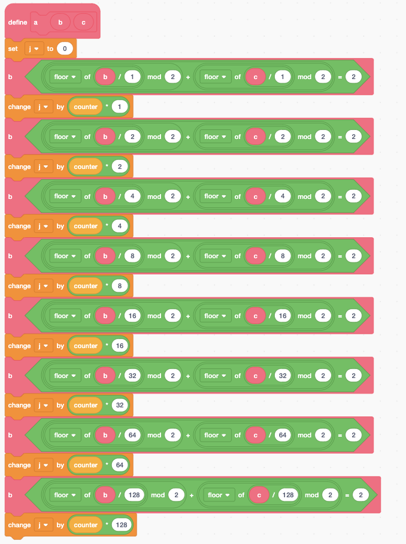

# chall
## Rev (499 points, first blood!)

> Do you remember Scratch? You'll need to for this next challenge.  
To input a flag, click the green flag and type in a flag. Press enter, then click Michael to check.

## Attachments

[scratchtastic_fixedflag2_c1.sb3](assets/scratchtastic/scratchtastic_fixedflag2_c1.sb3)

## Solution

Buckle up, this is an adventure.

Scratch is a block-based programming language, often used to teach programming since it is easy to visualize control flow. Normal Scratch looks something like this:


Awesome, this should be an easy challenge! Half of reversing is understanding what the code does, and it'll be easy to do in Scratch.

First, we can head over to https://scratch.mit.edu, and open up the project file.


Ok.... this is a little harder.

After a bit of internet searching, I found out that `.sb3` files are actually `zip` archives. A quick `binwalk` confirms this:

```
DECIMAL       HEXADECIMAL     DESCRIPTION
--------------------------------------------------------------------------------
0             0x0             Zip archive data, at least v1.0 to extract, compressed size: 48277, uncompressed size: 310497, name: project.json
48319         0xBCBF          Zip archive data, at least v1.0 to extract, compressed size: 565, uncompressed size: 560, name: 83a9787d4cb6f3b7632b4ddfebf74367.wav
48950         0xBF36          Zip archive data, at least v1.0 to extract, compressed size: 35670, uncompressed size: 37420, name: 83c36d806dc92327b9e7049a565c6bff.wav
84686         0x14ACE         Zip archive data, at least v1.0 to extract, compressed size: 4964, uncompressed size: 10041, name: 4da1a2d4dedae89f5a80e3617a1734eb.png
89716         0x15E74         Zip archive data, at least v1.0 to extract, compressed size: 1995, uncompressed size: 6158, name: bcf454acf82e4504149f7ffe07081dbc.svg
91777         0x16681         Zip archive data, at least v1.0 to extract, compressed size: 1947, uncompressed size: 6223, name: 0fb9be3e8397c983338cb71dc84d0b25.svg
93790         0x16E5E         Zip archive data, at least v1.0 to extract, compressed size: 40115, uncompressed size: 40172, name: bd29edac87677b86e487240283f2ed2d.png
133971        0x20B53         Zip archive data, at least v1.0 to extract, compressed size: 66, uncompressed size: 71, name: 5df1341a599a4c5a357fdac011da37c2.png
134103        0x20BD7         Zip archive data, at least v1.0 to extract, compressed size: 70, uncompressed size: 75, name: 8823b94034bc72de3fb71c10ed76215f.png
134953        0x20F29         End of Zip archive, footer length: 22
```

Now, we can unzip the file. We get a `project.json` file, which contains all the metadata of the project, including variables and blocks. I noticed specifically that the blocks had a `shadow: true` attribute. After a quick find and replace, I re-zipped the files together into a new `.sb3` file ([unshadow.sb3](assets/scratchtastic/unshadow.sb3)). After uploading this, we get... well, it _is_ Scratch code!


The next two hours were spent transpiling Scratch to Python. One technique I found super useful was the Scratch equivalent of print debugging:


From here, combined with the "duplicate" feature on blocks, it was trivial to evaluate the large constant blocks. I'm not going to show the Scratch code of each function, but the transpiled Python is shown below. The overall Scratch code is split up between the stage and a red dot; stage functions are indicated by a postfix `_s` or the naming convention `stage_<x>`, while dot functions are indicated by a postfix `_d` or the naming convention `dot_<x>`. The main tricky part came with the image parsing, which I'll explain after the code is shown. Additionally, a few bitwise functions are important to recognize:

Bitwise AND:



Bitwise OR:


Bitwise XOR:


These have different names between the stage and the dot, but their functionality remains the same.

After transpiling to Python, the code is now much easier to read!

```python
counter = 0

k = "0"
j = 1
h = "0x"
i = 1
l = "0"

sbox = [
  185, 157, 57, 122, 8, 242, 193, 103, 167, 62, 100, 71, 64, 156, 40, 248,
  73, 65, 155, 54, 10, 208, 152, 5, 187, 106, 195, 255, 212, 49, 131, 28,
  39, 138, 11, 20, 110, 19, 235, 209, 118, 159, 231, 50, 66, 239, 160, 107,
  115, 25, 92, 46, 204, 15, 246, 127, 95, 184, 119, 186, 223, 165, 236, 7,
  192, 80, 84, 99, 126, 247, 89, 199, 105, 151, 56, 23, 117, 210, 72, 51,
  178, 112, 183, 124, 148, 244, 104, 201, 218, 9, 111, 52, 3, 237, 76, 68,
  188, 225, 12, 177, 98, 173, 190, 238, 132, 250, 121, 213, 90, 243, 116, 196,
  197, 74, 120, 128, 145, 91, 93, 14, 16, 214, 176, 43, 163, 70, 205, 21,
  32, 222, 101, 45, 180, 59, 33, 134, 87, 142, 158, 166, 0, 30, 85, 125,
  169, 229, 216, 149, 221, 153, 26, 86, 63, 154, 215, 36, 2, 130, 79, 88,
  31, 254, 81, 18, 97, 171, 37, 38, 60, 4, 189, 34, 241, 240, 251, 13,
  82, 96, 141, 27, 170, 47, 207, 77, 55, 228, 249, 123, 1, 139, 140, 168,
  217, 194, 232, 202, 69, 211, 150, 206, 29, 114, 108, 227, 219, 182, 245, 230,
  179, 220, 143, 133, 6, 234, 67, 200, 253, 203, 147, 48, 42, 175, 174, 75,
  136, 162, 44, 224, 113, 129, 24, 135, 146, 35, 58, 78, 22, 144, 53, 83,
  198, 17, 109, 164, 94, 137, 41, 233, 181, 61, 226, 191, 172, 252, 102, 161
]

u = []

v = [
  "a", "b", "c", "d", "e", "f", "g", "h", "i", "j", "k", "l", "m", "n", "o", "p", "q", "r", "s", "t", "u", "v", "w", "x", "y", "z",
  "A", "B", "C", "D", "E", "F", "G", "H", "I", "J", "K", "L", "M", "N", "O", "P", "Q", "R", "S", "T", "U", "V", "W", "X", "Y", "Z",
  "0", "1", "2", "3", "4", "5", "6", "7", "8", "9", "{", "}"
] 

s = [
  "0.125",
  "5",
  "32",
  "48",
  "180",
  "240",
  "526344",
  "17303559"
]

flag = "irisctf{something}"

def check_flag():
  # wait stuff
  stage_b(100)

def stage_b(p):
  global j
  i = 0
  u = []
  for _ in range(p):
    j = i ^ 3
    j = [i for i in range(len(v)) if v[i] == flag[j]][0] ^ 3
    j = j & 63
    u = [j] + u
    permute(64)
    i += j
  call_b()

def permute(p):
  global j
  j = p
  for _ in range(98):
    idx = [i for i in range(len(sbox)) if sbox[i] == j] + 1
    j = 37 ^ idx
  stage_i()

def stage_i():
  global j
  stage_a()
  j = (len(flag) + 1) % (counter + 1)

def stage_a():
  global counter
  # weird mouse thing
  counter = 1

def stage_c(p):
  global counter
  counter = 1 if p else 0

def call_b():
  dot_recv_b()

def and_s(p, q):
  global j
  j = p & q

def or_s(p, q):
  global j
  j = p | q

def xor_s(p, q):
  global j
  j = p ^ q

# red dot

def and_d(p, q):
  global j
  j = p & q

def or_d(p, q):
  global j
  j = p | q

def xor_d(p, q):
  j = p ^ q

def dot_b(p):
  global counter
  counter = 1 if p else 0

def dot_recv_b():
  print('you receive confusion')
  dot_d()

def dot_d():
  global i, l
  i = 1
  l = 0
  dot_h()

def dot_h():
  for _ in range(100):
    check_vs_img()
  # if i == 1, win
  dot_g()

def check_vs_img():
  global l
  l += 1
  load_img_byte((l - 1) * 4)
  j = j ^ 169
  j = j ^ (l - 1)
  u_match_d()

def load_img_byte(p):
  global j
  global k
  k = 0
  get_img_value(p + 0)
  k += j
  get_img_value(p + 1)
  k += j * 4
  get_img_value(p + 2)
  k += j * 16
  get_img_value(p + 3)
  k += j * 64
  j = k
  return j

#################################

from PIL import Image

img = Image.open('cool-pixelated-bg.png')

print(img.size)

def number_to_pixel(v):
  return (v // 65536, (v // 256) % 256, v % 256)

def pixel_match(p1, p2):
  return all((a & 0xf8) == (b & 0xf8) for a, b in zip(p1, p2))

def pixel_to_number(px):
  j = 17303559
  while not pixel_match(px, number_to_pixel(j)):
    j -= 526344
  print(j)
  j = int(32 - ((j / 526344) + 0.125))
  return j

values = []

for r in range(36):
  for c in range(48):
    values.append(pixel_to_number(img.getpixel((c * 20 + 5, r * 20 + 5))))

def get_img_value(p):
  global j
  # move to x: (p % 48) * 10 + 5 - 240; y: 180 - ((p // 48) * 10 + 5)
  j = values[p]

loaded = [load_img_byte(i * 4) for i in range(100)]
print(loaded)

###############################

def u_match_d():
  dot_b(u[l - 1] == j)
  i = i * counter

def dot_g():
  global j
  # if i == 1, win
  dot_b(i == 1)
  j = counter
  orig_recv_k()

def orig_recv_k():
  if j == 1:
    print('flag')
```

### The Image

As I was transpiling Scratch to Python, I noticed that the red dot utilized the colors it was touching as part of the program. By removing the `hide` block from the end of the `j` function (transpiled to `get_img_value`), I was able to watch how the red dot moved; and found that it went around each cell of the background.


The background is shown below:


From here, I wrote a script using PIL to extract the pixel values from each cell. The background was scaled by a factor of 0.5x, so I had to take every 20th pixel instead of every 10th as the original Scratch code would. Additionally, Scratch only checks the first 5 bits of the red and green components and the first 4 bits of the blue component (https://scratch.mit.edu/projects/10941245), so I had to ensure that the Python code took that into account. Yes, I got lazy and made it compare 5 bits for all components. No, it didn't make a difference :)

### The Reversing

At this point, all that is left is to understand what the code is actually doing to check the flag! We see that overall, the code is divided into two separate logical units: the background populates the `u` array with values, while the dot compares it with stored values in the image. As this is reversing, we can work backwards. After looking at the code some more, we see that the function `load_img_byte` loads in four values from the image. We can run `get_img_value` on the pixels, and we notice that all values are always between 0 and 3. Combined with the fact that `load_img_byte` multiplies the four values by powers of 4, we know that this loads in 8 bits (1 byte) of information from the image, 2 bits at a time. We see that `load_img_byte` is called by `check_vs_img`, which is itself called by `dot_h`. `check_vs_img` is called 100 times, so we know some more information:

- We only have to get the first 100 bytes from the image.
- The flag is _probably_ 100 bytes.

After reversing the XOR in `check_vs_img`, we can re-create what the values in `u` must be for the correct flag:

```
img_values = [165, 184, 176, 150, 160, 190, 168, 161, 174, 172, 179, 185, 171, 169, 183, 161, 169, 163, 182, 168, 173, 187, 176, 178, 191, 176, 189, 191, 185, 164, 172, 181, 132, 154, 140, 133, 130, 128, 159, 149, 143, 141, 147, 133, 158, 135, 137, 134, 158, 151, 151, 138, 143, 146, 146, 142, 157, 128, 136, 159, 152, 134, 144, 153, 230, 228, 251, 241, 229, 251, 254, 233, 237, 240, 248, 238, 232, 244, 224, 233, 247, 245, 235, 244, 230, 255, 241, 254, 246, 255, 255, 226, 244, 228, 241, 203, 194, 218, 192, 219]

anticipated_values = [(j ^ 169) ^ i for i, j in enumerate(img_values)]

u = anticipated_values[::-1]
print(u)
```

`[17, 11, 18, 11, 61, 6, 16, 1, 16, 12, 15, 7, 0, 14, 3, 27, 14, 16, 13, 14, 15, 7, 16, 13, 12, 27, 16, 12, 7, 17, 23, 8, 27, 16, 12, 15, 15, 7, 18, 13, 13, 27, 16, 12, 16, 13, 14, 18, 16, 12, 15, 7, 0, 14, 3, 27, 7, 16, 13, 14, 27, 16, 12, 15, 15, 7, 18, 13, 3, 27, 16, 12, 13, 14, 0, 14, 12, 15, 7, 16, 18, 13, 27, 16, 7, 16, 13, 14, 27, 16, 12, 15, 15, 7, 18, 13, 60, 27, 16, 12]`

Next comes the background. In this step, we load in the flag, looping through each element of the flag and performing some bitwise operations on it, before adding it to `u`. One thing that I recognized was that `permute` actually does nothing; the actual update to the value of `j` is done by `stage_i`. After a bit more print debugging on the original Scratch code, I found that `j` is always `1` after a call to `stage_i`. Thus, we can completely ignore the call to `permute` in each iteration. At this point, we can complete the remaining reversing! Since all the operations are based around XOR, we can reverse them just by taking the exact same XOR.

```python
v = [
  "a", "b", "c", "d", "e", "f", "g", "h", "i", "j", "k", "l", "m", "n", "o", "p", "q", "r", "s", "t", "u", "v", "w", "x", "y", "z",
  "A", "B", "C", "D", "E", "F", "G", "H", "I", "J", "K", "L", "M", "N", "O", "P", "Q", "R", "S", "T", "U", "V", "W", "X", "Y", "Z",
  "0", "1", "2", "3", "4", "5", "6", "7", "8", "9", "{", "}"
] 

flag = [" "] * 100

i = 0
for idx in range(100):
  flag_idx = i ^ 3
  corr_j = u[idx]
  v_idx = corr_j ^ 3
  flag[flag_idx] = v[v_idx]
  i += 1

print(''.join(flag))
```

`irisctf{emptyandnotnotemptyplusemptyoremptyornotemptyandnotemptyoremptyandnotemptyornotemptyorempty}`

Not going to even try to figure out what that evaluates to ;)
